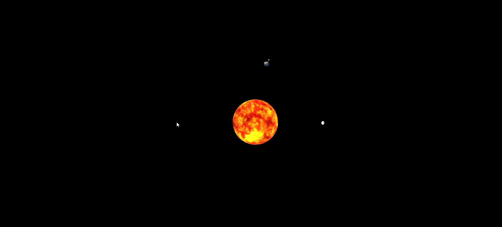

# Inner Solar System Simulation

## Overview

A simulation of the inner solar system made with Javascript and [Three.js](https://threejs.org/). Orbit and rotation speeds are to scale and two minues is equivalent to one Earth year. To ensure all planets are visible on screen, planet sizes and orbit radii are exaggerated. 
[Try a demo](https://js-solar-system-simulation-nk.netlify.app/)

## Todo
- Optimise execution speed
- Express rotation and orbit increments in time rather than in degrees 

## Acknoledgements
Created by Nasser Kessas

## Contributing
PRs accepted, feel free to dive in! [Open an issue](https://github.com/nasserkessas/threejs-solar-system-simulation/issues/new) or submit PRs.

threejs-solar-system-simulation follows the [Contributor Covenant](http://contributor-covenant.org/version/1/3/0/) Code of Conduct.